<div align="center">

# SecureAI Assistant

### Enterprise-grade AI Chat Platform built with Angular, Spring Boot, JWT Authentication, OAuth2, PostgreSQL and OpenAI.

<br/>

[](https://openjdk.org/projects/jdk/21/)
[](https://spring.io/projects/spring-boot)
[](https://angular.io/)
[](https://neon.tech/)
[](https://jwt.io/)
[](https://developers.google.com/identity/protocols/oauth2)
[](https://www.docker.com/)
[](https://vercel.com/)
[](https://render.com/)

<br/>

[](https://github.com/Raman-8688/secure-ai-assistant/stargazers)
[](https://github.com/Raman-8688/secure-ai-assistant/network/members)
[](https://github.com/Raman-8688/secure-ai-assistant/issues)
[](https://github.com/Raman-8688/secure-ai-assistant/commits/main)
[](https://github.com/Raman-8688/secure-ai-assistant)
[](LICENSE)

<br/>

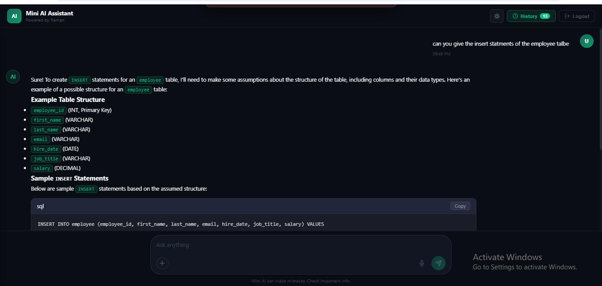

<br/><br/>

**[Live Demo](https://secure-ai-assistant-roan.vercel.app)** &nbsp;·&nbsp; **[API Docs](#api-reference)** &nbsp;·&nbsp; **[Give a Star](https://github.com/Raman-8688/secure-ai-assistant)**

</div>

---

## Table of Contents

- [Why I Built This](#why-i-built-this)
- [Project Highlights](#project-highlights)
- [Feature Overview](#feature-overview)
- [Tech Stack](#tech-stack)
- [System Architecture](#system-architecture)
- [Authentication Flow](#authentication-flow)
- [Database Schema](#database-schema)
- [API Reference](#api-reference)
- [Project Structure](#project-structure)
- [Screenshots](#screenshots)
- [Environment Configuration](#environment-configuration)
- [Local Development Setup](#local-development-setup)
- [Deployment Architecture](#deployment-architecture)
- [Challenges Faced](#challenges-faced)
- [What I Learned](#what-i-learned)
- [Future Enhancements](#future-enhancements)

---

## Why I Built This

SecureAI Assistant was built to demonstrate how enterprise-grade authentication, AI integration, and cloud deployment can be combined into a production-ready full-stack application. Most student projects stop at CRUD — this one goes further.

The goal was to implement the exact security patterns used in real-world MNC applications: stateless JWT, OAuth2 social login, OTP-based email verification, rate-limited password reset, and role-based access — all wired into a modern Angular 17 frontend with voice input and persistent chat history.

Everything is deployed on real cloud infrastructure: Angular on Vercel CDN, Spring Boot as a Docker container on Render, and PostgreSQL on Neon's serverless cloud.

---

## Project Highlights

| Capability | Detail |
|---|---|
| JWT Authentication | Stateless, HS256-signed, configurable TTL |
| Google OAuth2 | Full social login with custom success handler |
| Email OTP Verification | 6-digit OTP sent via SMTP, time-limited |
| Forgot Password | UUID token, rate-limited, expiry-checked |
| AI Chat | OpenAI-compatible API, per-user history |
| Voice Input | Web Speech API — talk to the AI |
| Chat History | Stored in PostgreSQL, user-scoped, deletable |
| Dark / Light Theme | Global theme system with persistence |
| Responsive UI | Works on desktop and mobile |
| Docker | Production-ready containerized backend |
| Cloud Deployed | Vercel (frontend) + Render (backend) + Neon (DB) |
| Spring Security 6 | Full filter chain, CORS, stateless session |

---

## Feature Overview

| Feature | Status |
|---|---|
| JWT Authentication | ✅ |
| Google OAuth2 Login | ✅ |
| Email OTP Verification | ✅ |
| Resend OTP | ✅ |
| Forgot Password | ✅ |
| Password Reset (Token) | ✅ |
| AI Chat (Q&A) | ✅ |
| Chat History (Save / View) | ✅ |
| Delete Chat History | ✅ |
| Voice Input | ✅ |
| Dark Mode | ✅ |
| Light Mode | ✅ |
| Responsive Layout | ✅ |
| Docker Containerization | ✅ |
| Production Deployment | ✅ |
| Environment Profiles | ✅ |
| Global Error Handling | ✅ |
| Auth Guard (Route Protection) | ✅ |

---

## Tech Stack

| Layer | Technology | Purpose |
|---|---|---|
| Backend Language | Java 21 | Core runtime |
| Backend Framework | Spring Boot 3.x | REST API, DI, autoconfiguration |
| Security | Spring Security 6 | Filter chain, auth, CORS |
| Token Auth | JWT (jjwt) | Stateless authentication |
| Social Login | OAuth2 (Spring Security) | Google login |
| Email | Spring Mail + Gmail SMTP | OTP & password reset emails |
| AI Integration | OpenAI-compatible API | Chat completions (GPT-3.5-turbo) |
| ORM | Spring Data JPA / Hibernate | Database abstraction |
| Database | PostgreSQL (Neon cloud) | User & chat data persistence |
| Frontend | Angular 17 (Standalone) | SPA framework |
| Styling | SCSS + CSS Variables | Theming system |
| Voice Input | Web Speech API | Voice-to-text chat |
| Containerization | Docker | Backend packaging |
| Frontend Hosting | Vercel | CDN deployment |
| Backend Hosting | Render | Docker container hosting |
| Build Tool | Maven | Backend dependency management |

---

## System Architecture

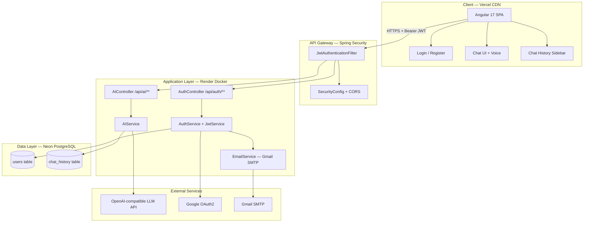

---

## Authentication Flow

### Registration + OTP Verification

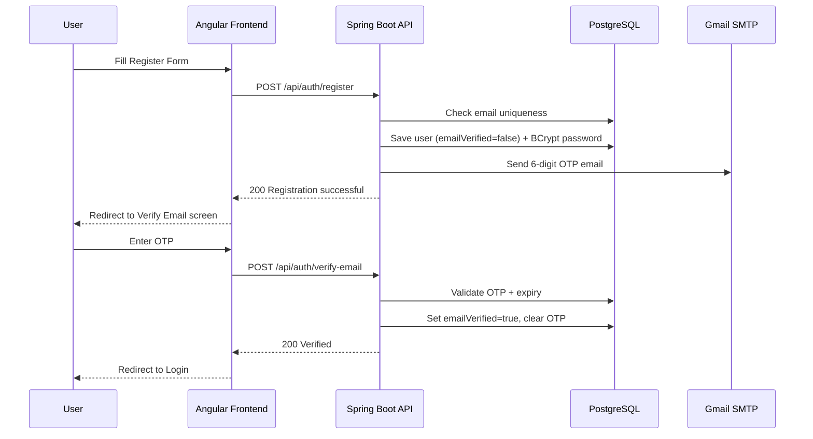

### JWT Login & API Authorization

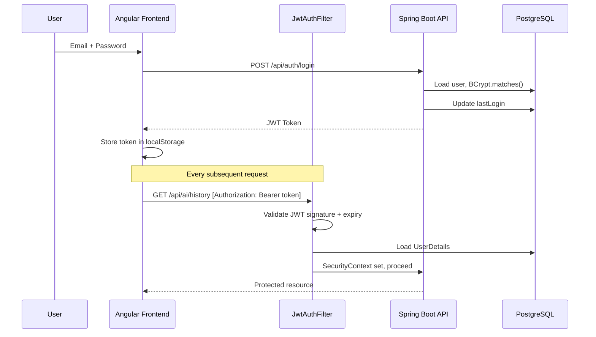

### OAuth2 Google Login

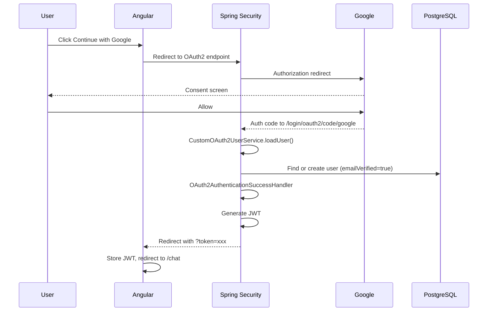

---

## Database Schema

### users table

| Column | Type | Constraint | Notes |
|---|---|---|---|
| id | BIGSERIAL | PK | Auto-increment |
| name | VARCHAR | NOT NULL | Display name |
| email | VARCHAR | NOT NULL, UNIQUE | Used as username |
| password | VARCHAR | NULLABLE | Null for OAuth2 users |
| role | VARCHAR | NOT NULL | Default: USER |
| email_verified | BOOLEAN | NOT NULL | Default: false |
| verification_otp | VARCHAR | NULLABLE | 6-digit OTP |
| otp_expiry_time | TIMESTAMP | NULLABLE | OTP expiration |
| created_at | TIMESTAMP | NOT NULL | Set via @PrePersist |
| provider | VARCHAR | NULLABLE | google or null |
| provider_id | VARCHAR | NULLABLE | OAuth2 provider user ID |
| last_login | TIMESTAMP | NULLABLE | Updated on login |
| reset_token | VARCHAR | NULLABLE | UUID for password reset |
| reset_token_expiry | TIMESTAMP | NULLABLE | Token expiration |
| last_password_reset | TIMESTAMP | NULLABLE | Audit field |
| password_reset_attempts | INTEGER | NULLABLE | Rate limiting counter |
| reset_token_generated_at | TIMESTAMP | NULLABLE | Rate limiting timestamp |

### chat_history table

| Column | Type | Constraint | Notes |
|---|---|---|---|
| id | BIGSERIAL | PK | Auto-increment |
| user_email | VARCHAR | NOT NULL | Scoped to user |
| question | TEXT | NOT NULL | User's prompt |
| answer | TEXT | NOT NULL | AI response |
| created_at | TIMESTAMP | NOT NULL | Default: now() |

---

## API Reference

### Authentication Endpoints

| Method | Endpoint | Auth | Description |
|---|---|---|---|
| POST | `/api/auth/register` | Public | Register, sends OTP email |
| POST | `/api/auth/verify-email` | Public | Verify OTP, activate account |
| POST | `/api/auth/login` | Public | Login, returns JWT |
| POST | `/api/auth/resend-otp` | Public | Resend OTP |
| GET | `/api/auth/me` | JWT | Current user profile |
| POST | `/api/auth/forgot-password` | Public | Send reset link |
| GET | `/api/auth/validate-reset-token` | Public | Validate reset token |
| POST | `/api/auth/reset-password` | Public | Set new password |

### AI Endpoints

| Method | Endpoint | Auth | Description |
|---|---|---|---|
| POST | `/api/ai/ask` | JWT | Send question, get AI answer, save history |
| GET | `/api/ai/history` | JWT | Get user's chat history |
| DELETE | `/api/ai/history/{id}` | JWT | Delete a chat item |

---

## Project Structure

```
secure-ai-assistant/
│
├── backend/                             Spring Boot (Java 21)
│   └── src/main/java/.../aiapi/
│       ├── config/
│       │   ├── SecurityConfig.java      Spring Security, CORS, filter chain
│       │   ├── JwtAuthenticationFilter  JWT extraction and validation
│       │   ├── OAuth2SuccessHandler     Post-OAuth2 JWT generation
│       │   └── PasswordEncoderConfig    BCrypt bean
│       │
│       ├── controller/
│       │   ├── AuthController           /api/auth/** endpoints
│       │   └── AIController             /api/ai/** endpoints
│       │
│       ├── service/
│       │   ├── AuthService              Registration, login, OTP, reset logic
│       │   ├── JwtService               Token generation and validation
│       │   ├── AIService                OpenAI API REST client
│       │   ├── EmailService             Email abstraction interface
│       │   ├── SendGridEmailService     SMTP implementation (Gmail)
│       │   └── CustomOAuth2UserService  OAuth2 user loading and DB sync
│       │
│       ├── entity/
│       │   ├── User.java                users table mapping
│       │   └── ChatHistory.java         chat_history table mapping
│       │
│       ├── repository/
│       │   ├── UserRepository           JPA queries for users
│       │   └── ChatHistoryRepository    Chat data access and ordering
│       │
│       ├── dto/
│       │   ├── requests/                RegisterRequest, LoginRequest, etc.
│       │   └── response/                AuthResponse, AIResponse, etc.
│       │
│       ├── exception/
│       │   ├── GlobalExceptionHandler   @ControllerAdvice error handling
│       │   └── ErrorResponse            Structured error payload
│       │
│       └── resources/
│           ├── application.properties   Main config (env-var based)
│           ├── application-local.props  Local dev profile
│           └── application-prod.props   Production profile
│
├── frontend/                            Angular 17 (Standalone Components)
│   └── src/app/
│       ├── core/
│       │   ├── guards/auth.guard.ts     Route protection (JWT check)
│       │   ├── interceptors/            JWT header injection + error handling
│       │   ├── models/                  TypeScript interfaces
│       │   └── services/
│       │       ├── auth.service.ts      Auth API calls + JWT storage
│       │       ├── ai.service.ts        Chat API calls + history
│       │       └── theme.service.ts     Dark/light theme management
│       │
│       ├── features/
│       │   ├── auth/
│       │   │   ├── login/               Login form + OAuth2 buttons
│       │   │   ├── register/            Registration form
│       │   │   ├── verify-email/        OTP entry screen
│       │   │   ├── forgot-password/     Reset request form
│       │   │   ├── reset-password/      New password form
│       │   │   └── callback/            OAuth2 redirect handler
│       │   ├── chat-ui/                 Main chat page + history sidebar
│       │   └── components/
│       │       ├── chat-input/          Voice + text input component
│       │       ├── chat-message/        Message bubble component
│       │       └── markdown-renderer/   AI response markdown display
│       │
│       └── shared/
│           └── components/auth-layout/  Shared two-panel auth layout
│
├── frontend/src/assets/docs/screenshots/   All UI screenshots
├── Dockerfile                           Backend Docker configuration
└── README.md
```

---

## Screenshots

### Login Page

<table>
  <tr>
    <td align="center"><b>Dark Mode</b></td>
    <td align="center"><b>Light Mode</b></td>
  </tr>
  <tr>
    <td>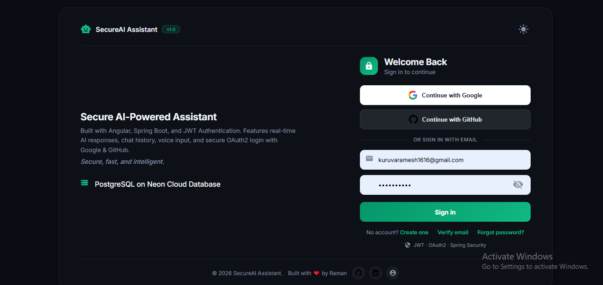</td>
    <td>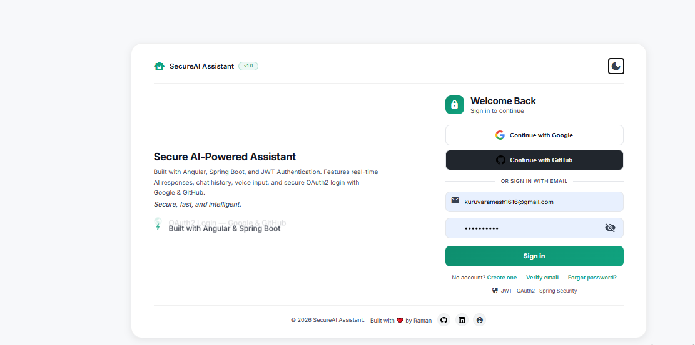</td>
  </tr>
</table>

### Register Page

<table>
  <tr>
    <td align="center"><b>Dark Mode</b></td>
    <td align="center"><b>Light Mode</b></td>
  </tr>
  <tr>
    <td>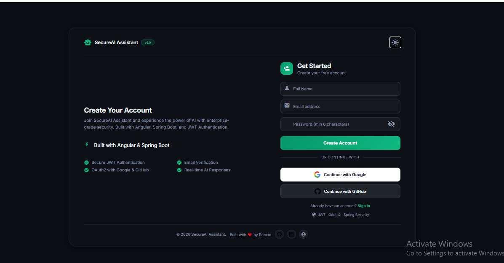</td>
    <td>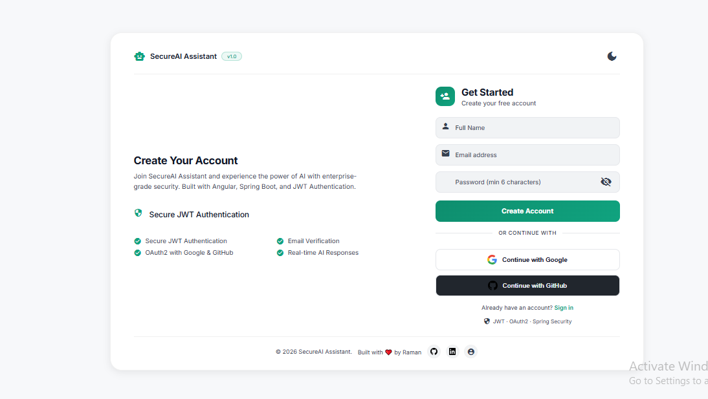</td>
  </tr>
</table>

### Forgot Password

<table>
  <tr>
    <td align="center"><b>Dark Mode</b></td>
    <td align="center"><b>Light Mode</b></td>
  </tr>
  <tr>
    <td>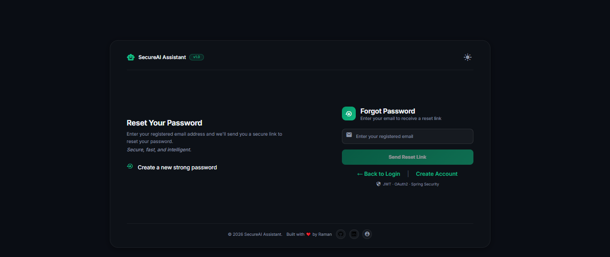</td>
    <td>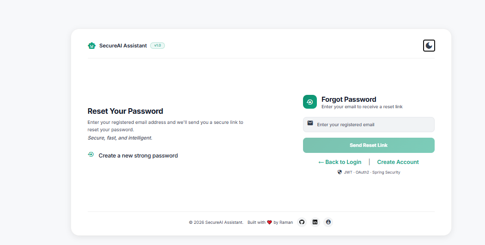</td>
  </tr>
</table>

### AI Chat Interface

<table>
  <tr>
    <td align="center"><b>Dark Mode — With Chat Data</b></td>
    <td align="center"><b>Light Mode — With Chat Data</b></td>
  </tr>
  <tr>
    <td></td>
    <td>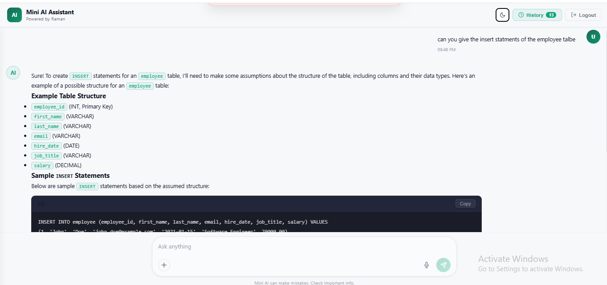</td>
  </tr>
</table>

<table>
  <tr>
    <td align="center"><b>Chat Interface — Dark</b></td>
    <td align="center"><b>Chat Interface — Light</b></td>
  </tr>
  <tr>
    <td>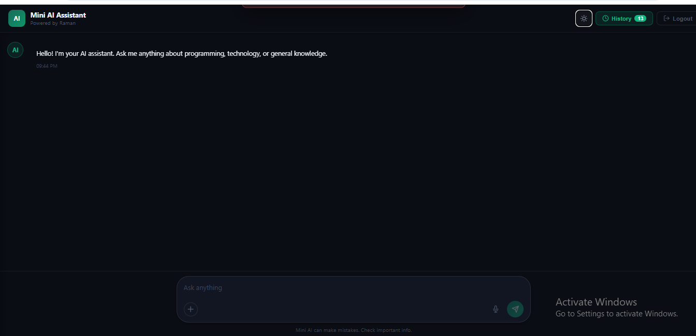</td>
    <td>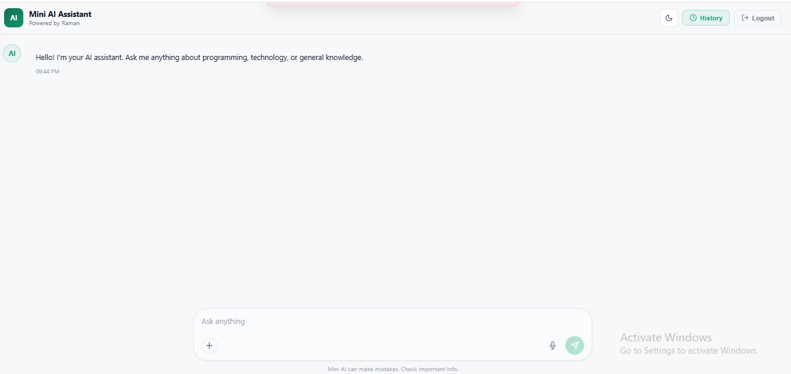</td>
  </tr>
</table>

---

## Environment Configuration

All sensitive values are externalized as environment variables. The backend supports Spring profiles (`local`, `prod`).

### Backend Environment Variables

| Variable | Description | Example |
|---|---|---|
| `DB_URL` | PostgreSQL JDBC URL | `jdbc:postgresql://neon.tech/aidb` |
| `DB_USERNAME` | Database username | `aidb_user` |
| `DB_PASSWORD` | Database password | `***` |
| `JWT_SECRET` | HS256 signing secret (min 256-bit) | `your-256bit-secret` |
| `JWT_EXPIRATION` | Token TTL in milliseconds | `86400000` |
| `MAIL_USERNAME` | SMTP sender email | `app@gmail.com` |
| `MAIL_PASSWORD` | Gmail App Password | `***` |
| `AI_API_URL` | OpenAI-compatible completions endpoint | `https://api.openai.com/v1/chat/completions` |
| `AI_API_KEY` | LLM provider API key | `sk-...` |
| `GOOGLE_CLIENT_ID` | Google OAuth2 client ID | `xxx.apps.googleusercontent.com` |
| `GOOGLE_CLIENT_SECRET` | Google OAuth2 client secret | `***` |
| `PORT` | Server port (Render sets automatically) | `8080` |

### Frontend Environment Variables

| Variable | Description |
|---|---|
| `apiUrl` | Backend base URL (set in `environment.ts`) |

---

## Local Development Setup

### Prerequisites

- Java 21+
- Node.js 18+
- Angular CLI 17 — `npm install -g @angular/cli`
- Maven 3.9+
- PostgreSQL (local) or a free [Neon](https://neon.tech) account

### 1. Clone

```bash
git clone https://github.com/Raman-8688/secure-ai-assistant.git
cd secure-ai-assistant
```

### 2. Configure Backend

Create `src/main/resources/application-local.properties`:

```properties
spring.datasource.url=jdbc:postgresql://localhost:5432/secureai
spring.datasource.username=postgres
spring.datasource.password=yourpassword
jwt.secret=your-local-256-bit-secret-key-here
jwt.expiration=86400000
spring.mail.username=your@gmail.com
spring.mail.password=your-app-password
ai.api.url=https://api.openai.com/v1/chat/completions
ai.api.key=sk-your-key
spring.security.oauth2.client.registration.google.client-id=your-client-id
spring.security.oauth2.client.registration.google.client-secret=your-client-secret
```

### 3. Run Backend

```bash
cd backend
mvn spring-boot:run -Dspring-boot.run.profiles=local
# API available at http://localhost:8080
```

### 4. Run Frontend

```bash
cd frontend
npm install
ng serve
# App available at http://localhost:4200
```

### 5. Run via Docker

```bash
docker build -t secure-ai-backend .
docker run -p 8080:8080 \
  -e DB_URL=jdbc:postgresql://... \
  -e JWT_SECRET=... \
  -e MAIL_USERNAME=... \
  -e AI_API_KEY=... \
  secure-ai-backend
```

---

## Deployment Architecture

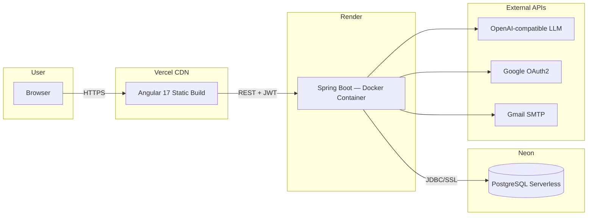

Key deployment notes:

- Backend runs as a Docker container on Render with `$PORT` auto-configured
- Frontend is a static Angular build deployed to Vercel with SPA routing configured via `vercel.json`
- OAuth2 redirect URI is registered in Google Cloud Console pointing to the Render service URL
- All secrets are injected as environment variables — no hardcoded credentials anywhere

---

## Challenges Faced

| Challenge | How It Was Solved |
|---|---|
| JWT Integration with Spring Security 6 | Built a custom `JwtAuthenticationFilter` inserted before `UsernamePasswordAuthenticationFilter` |
| OAuth2 Social Login | Implemented `CustomOAuth2UserService` + `OAuth2AuthenticationSuccessHandler` to generate JWT post-OAuth2 |
| Email OTP Verification | Spring Mail + Gmail SMTP with App Password, OTP stored with expiry timestamp |
| Render Docker Deployment | Fixed `ENTRYPOINT` syntax in `Dockerfile`, exposed `$PORT` via `application.properties` |
| OAuth2 Redirect URI Mismatch | Maintained separate redirect URIs in Google Console for local and production environments |
| CORS in Production | Configured allowed origins in `SecurityConfig` matching exact Vercel deployment URL |
| OpenAI-compatible API Integration | Used `RestTemplate` with bearer auth, parsing `choices[0].message.content` from JSON response |
| PostgreSQL on Neon | Configured JDBC SSL URL with correct driver and Hibernate dialect |

---

## What I Learned

- Spring Security 6 filter chain and how to integrate stateless JWT into it
- OAuth2 authorization code flow end-to-end (redirect to callback to JWT)
- JWT token lifecycle: generation, signing (HS256), validation, expiry
- OTP-based email verification patterns with time-limited tokens
- REST API design with layered architecture (Controller, Service, Repository)
- Spring profile-based environment configuration for local vs production
- Docker containerization of a Spring Boot application
- Cloud deployment: Vercel (frontend CDN) + Render (backend containers) + Neon (serverless DB)
- Angular 17 standalone components, lazy-loaded routes, reactive forms
- Angular HTTP interceptors for automatic JWT header injection
- Web Speech API integration for voice-to-text input
- CSS variable-based global theming (dark/light mode)

---

## Future Enhancements

| Enhancement | Priority |
|---|---|
| GitHub OAuth2 Login | High |
| Streaming AI Responses (SSE) | High |
| Markdown Rendering for AI output | High |
| Redis Caching for session management | Medium |
| Docker Compose for full-stack local setup | Medium |
| Unit and Integration Testing (JUnit + Mockito) | Medium |
| AI Conversation Export (PDF/TXT) | Medium |
| Multiple AI Model Selection | Medium |
| File Upload Support | Low |
| CI/CD Pipeline (GitHub Actions) | Low |
| Kubernetes Deployment | Low |
| Rate Limiting on AI endpoints | Low |

---

<div align="center">

Built by **[Raman Boya](https://github.com/Raman-8688)** — Java Full Stack Developer, Hyderabad

[](https://github.com/Raman-8688)
[](https://linkedin.com/in/ramanjaneyulu-boya)
[](https://github.com/Raman-8688/portfolio-projects)

</div>
